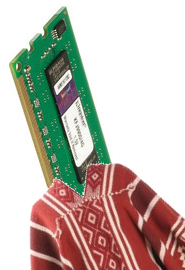
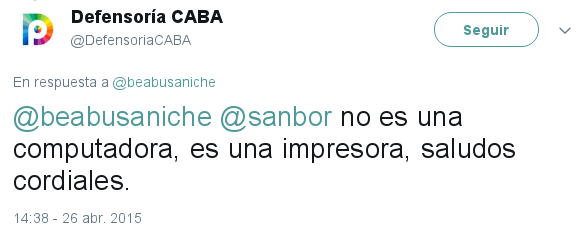

%No es una impresora, es una máquina de voto
%Ignacio E. Losiggio
%29/09/17 (ekoparty)

#$ whoami

## Ignacio Losiggio (@memepowered)

* Dev. en Huayra GNU/Linux
* Estudio CS de la Computación (UBA-Exactas)

#1. Es una impresora

¿Qué puede salir mal?

. . .

Son los primeros dispositivos IOT, todo IOT está roto (mal software, configuración nula, passwords por defecto, etc).

#2. Caso de estudio: Ilusionistas informáticos

## Microimpresiones
Nicolás D'Ippolito y Hernán Melgratti mostraron un sistema con microimpresiones puede revelar el orden de voto (y así romper el secreto) 

. . .

Dependía de tener malicia en el sistema

#2. Caso de estudio: Ilusionistas informáticos

Si no asumimos malicia en el sistema ¿Cómo nos divertimos?

. . .

En el senado hubo una propuesta del peor sistema posible:

. . .

**Suposición:** podemos imprimir _una_ hoja arbitraria

#3. PostScript, programando hojas de papel

Las páginas de impresión se especifican en PostScript en muchas impresoras (incluso en muchas modernas por retrocompatibilidad)

##Características:

> * Es en lenguaje de programación, posta, no jodo
> * Stack-based
> * Usado casi exclusivamente para impresión y administración de impresoras
> * **El estado se revierte finalizado el trabajo de impresión**

#3. PostScript, programando hojas de papel

##El verbo que necesitaba: `startjob`

Limpia todos los stacks (gráfico, operadores, ejecución, diccionarios, etc), restaura el estado inicial de la VM de PostScript y continúa la ejecución desde el siguiente verbo _del trabajo de impresión_.

. . .

Se puede usar de dos formas posibles:

  * `true <password> startjob`; Crea un nuevo trabajo de impresión, **los cambios al estado son persistentes**
  * `false <password> startjob`: Crea un nuevo trabajo de impresión

#3. PostScript, programando hojas de papel

## Idea

Generar un trabajo de impresión que condicione los siguientes (deniegue ciertas boletas o formularios, imprima cosas inesperadas, **cuente boletas de papel**)

. . .

#3. PostScript, programando hojas de papel

## vot.ar.ps, tareas:

> 1. Detectar que la página imprimiéndose es una boleta
> 2. Cambiar a contexto persitente, contar el voto
> 3. Cambiar a contexto común, restaurar los gráficos anteriores e imprimir

#4. Problemas para seguir investigando

* La implementación actual depende de que el trabajo de impresión sea únicamente identificable en tres lugares independientes
* PostScript es complejo y es posible que tenga errores ¿Podemos ejecutar algo por fuera de la VM? (Transmitir datos en tiempo real en impresoras con red)
* Hay otras formas de describir las páginas que son más modernas
* Nuestra impresora no tiene reloj :(
* Identificar votantes y agregar metadatos podría facilitarse mucho con una impresora más moderna
* Actualmente la persistencia es en RAM tocar el firmware sería un golazo

#5. Conclusión

Imprimir = **ejecución de código arbitrario**

#6. Fuentes y recursos

* PostScript Language Reference Manual: https://www-cdf.fnal.gov/offline/PostScript/PLRM2.pdf
* Printer Exploitation Toolkit: https://github.com/RUB-NDS/PRET
* Hacking Printers: http://hacking-printers.net/wiki/index.php/Main_Page
* vot.ar.ps: https://github.com/iglosiggio/vot.ar.ps

. . .

## Mil gracias a Javi, Iván y a todos los chicos de HackThePrinter por el aguante

#6. ¿Preguntas?

. . .

## Hack the printer!

